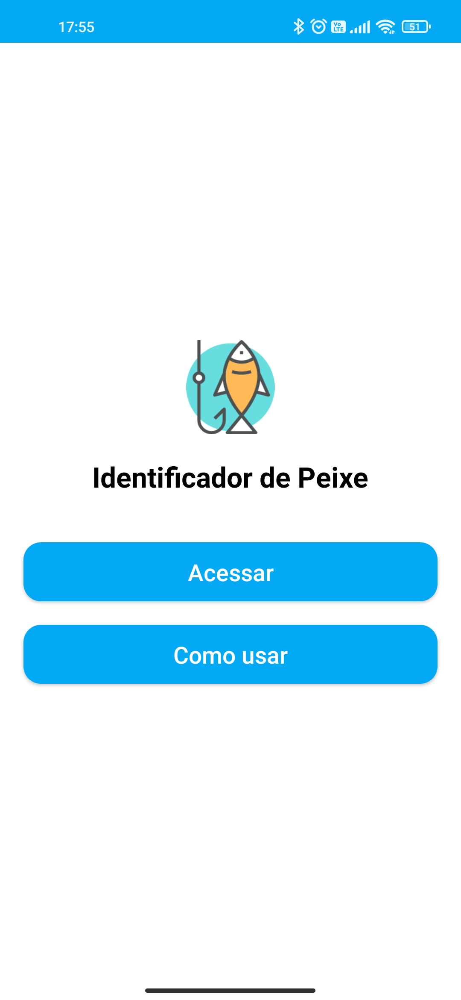
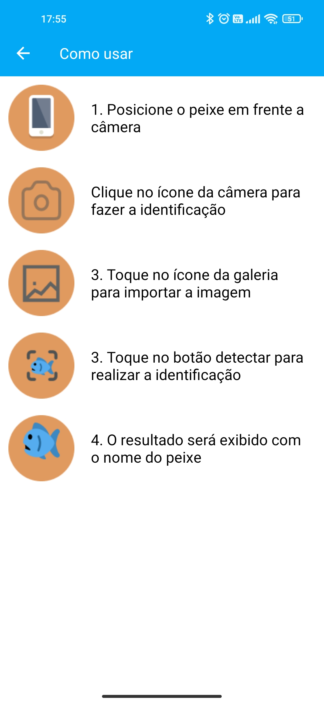
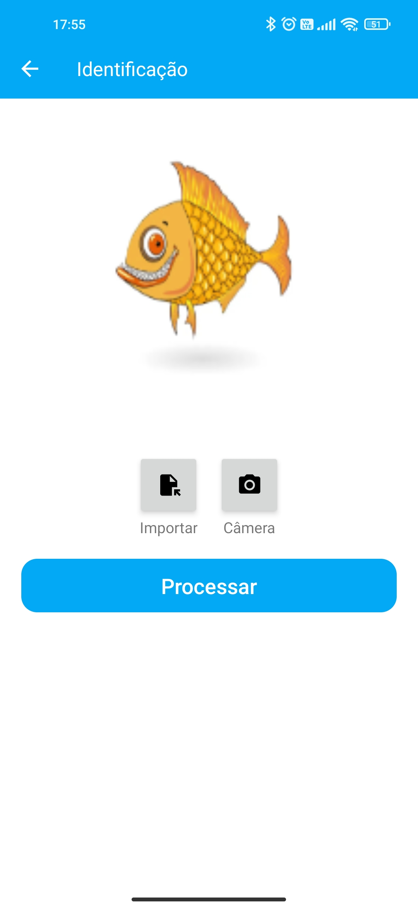
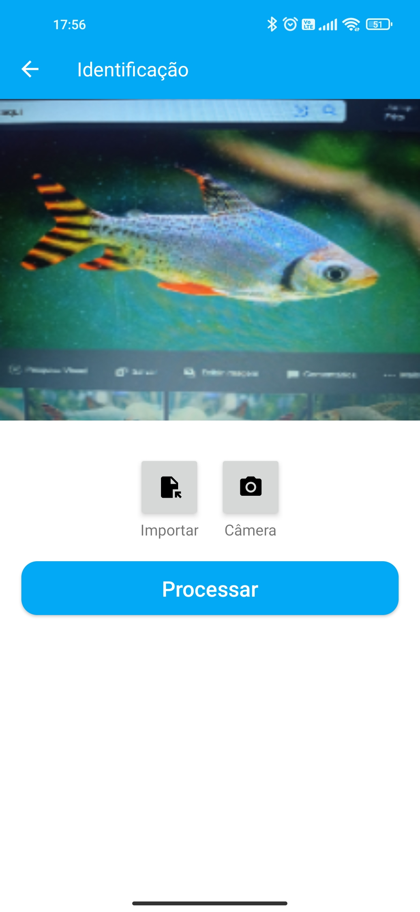
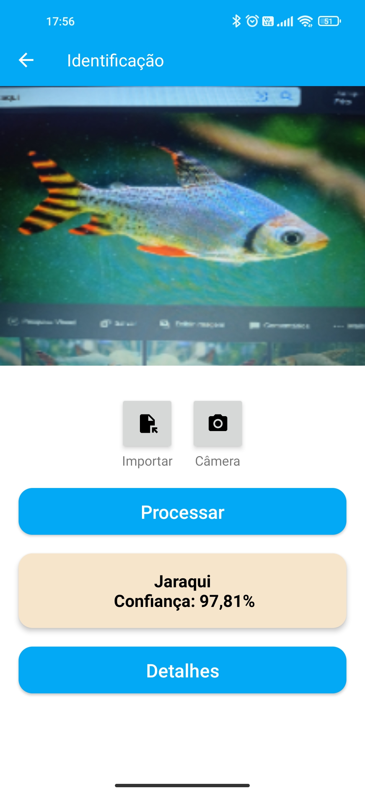
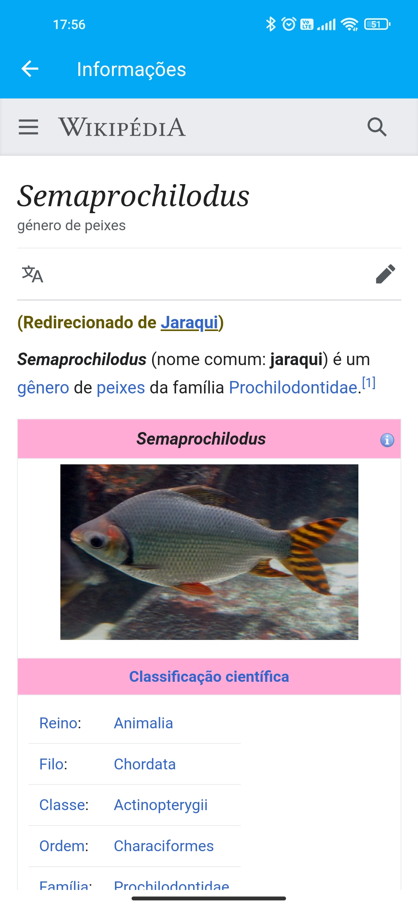

# **Identificação Automática de Peixes  Nativos da Região Amazônica**

Este projeto é uma solução de identificação automática de espécies de peixes nativos da região amazônica, utilizando as seguintes tecnologias:
- MobileNet
- Kotlin
- Teachable Machine.

## Como funciona
O aplicativo permite que os usuários capturem imagens de peixes com a câmera de seus dispositivos móveis. Em seguida, o modelo de aprendizado de máquina treinado com a rede neural MobileNet analisa a imagem e identifica a espécie do peixe, exibindo o resultado na tela do dispositivo.

## Como foi construído
Para treinar o modelo, utilizei o Teachable Machine, uma plataforma que torna o treinamento de modelos de aprendizado de máquina mais acessível e intuitivo. Depois de treinado, o modelo foi convertido para o formato TensorFlow e integrado em um aplicativo Android construído com a linguagem de programação Kotlin.

## Capturas de tela
Aqui estão algumas capturas de tela do aplicativo em ação:

  
  
  
  
  
  
  

As imagens acima mostram a interface do aplicativo e como ele identifica automaticamente a espécie de peixe na imagem capturada pela câmera do dispositivo.

## Vídeo demonstrativo

[Assista ao vídeo demonstrativo](https://youtu.be/ybca5VQUMog)

## Como usar
1. Clone este repositório
2. Abra o projeto no Android Studio
3. Execute o projeto em um dispositivo Android ou em um emulador
4. Tire uma foto de um peixe e aguarde a identificação automática da espécie
##Como contribuir
Este projeto é de código aberto e qualquer contribuição é bem-vinda. Se você deseja contribuir, por favor, faça um fork deste repositório e envie um pull request com suas alterações.

## Contato
Se tiver dúvidas ou sugestões sobre o projeto, sinta-se à vontade para entrar em contato comigo

